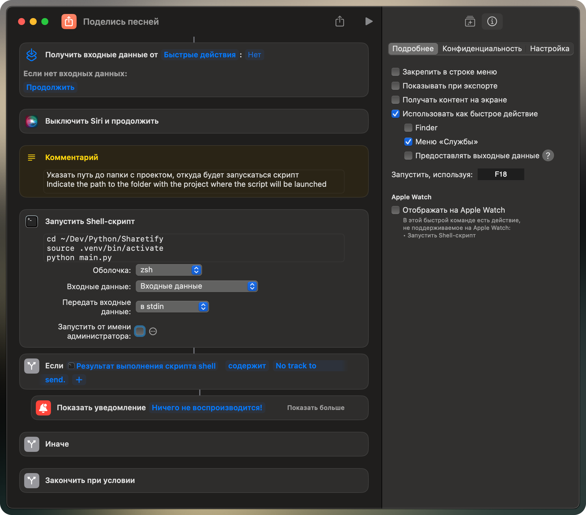

# Sharetify

[English](#Description)

## Описание

### Sharetify — это инструмент для быстрой отправки текущего трека из Spotify в Telegram. Запусти скрипт либо используй Siri (в __Shortcuts.app__) или горячие клавиши (в __Shortcuts.app__), и Sharetify мгновенно поделится тем, что ты слушаешь.

- Скрипт получает текущий трек в __Spotify__ и отправляет его в __Telegram__ указанному пользователю в виде ссылки;
- Скрипт написан для интеграции в приложение __Shortcuts.app__ на __MacOS__ и использует __AppleScript__;
- Скрипт может быть использован в отрыве от __Shortcuts.app__, как самостоятельный __Python__-скрипт.

## Использование

1. Скачать файлы из этого репозитория;
2. Получить `API_ID` и `API_HASH` от [Telegram](https://my.telegram.org) _(при первом запуске откроется автоматически)_;
3. Переименовать скрытый файл __.env.example__ в __.env__: \
   `cd Sharetify && mv .env.example .env`
4. Заполнить `APP__TELEGRAM__API_ID`, `APP__TELEGRAM__API_HASH` и `APP__TELEGRAM__TARGET_USER` в __.env__:
    - `APP__TELEGRAM__TARGET_USER` это _@username_ или его _ID_, которому нужно отправить трек;
    - `APP__SYSTEM__LANGUAGE=ru` для получения сообщения на русском языке;
5. Создать и активировать виртуальное окружение: \
   `python -m venv .venv && source .venv/bin/activate`
6. Установить зависимости: \
   `pip install -r requirements.txt`
7. На этом этапе сам скрипт уже готов к использованию:
    - Первый запуск необходимо выполнить вручную (__не Shortcuts.app__): \
      `python main.py`
    - Будет запрошен номер телефона или токен бота для аутентификации (это механизмы __Telegram__):
        1. _если указать номер телефона, сообщения будут отправляться от имени владельца аккаунта (личным сообщением или в __Избранное__, если отправлять самому себе);_
        2. _если указать токен вашего бота, то сообщения будут приходить от имени бота;_
    - В __Telegram__ придет код подтверждения от пользователя __Telegram__;
    - После успешной аутентификации в папке проекта создастся файл __session.session__, который будет использоваться для авторизации в __Telegram__ без повторного ввода учетных данных;
    - Последующие запуски скрипта будут происходить без подтверждения (если существует файл __session.session__);
8. Далее можно добавить скрипт в __Shortcuts.app__:
    - В __Shortcuts.app__ добавить новую команду;
    - Добавить действие "__Запустить Shell-скрипт__" и в поле вставить строки:
      ```bash:
      cd /path/to/Sharetify  # заменить на путь к проекту
      source . venv/bin/activate
      python main.py
      ```
    - В пункте "__Передать входные данные__" выбрать: `B stdin`
    - _(Опционально)_ Можно добавить условие на основании результата выполнения скрипта:
        - Если `Результат выполнения скрипта shell содержит No track to send.` (_текст_), то... _например, отправить уведомление_
        - Иначе... _я оставил пустым_
    - _(Опционально)_ Добавить __горячую клавишу__ для максимально быстрого запуска скрипта \
      _(можно и с помощью __Siri__ вызывать, но это не удобно, потому что у меня она каждый раз вылазит на телефоне, а не на ноутбуке и, соответственно, не работает команда; кроме того она постоянно приглушает звук и это тоже не то, что я хотел бы)_

---

[back to top](#sharetify)

---

## Description

### Sharetify is a tool for quickly sharing your current Spotify track to Telegram. Run the script or use Siri (in __Shortcuts.app__) or hotkey (in __Shortcuts.app__), and Sharetify will instantly send what you're listening to.

- The script fetches the currently playing track from __Spotify__ and sends it to a specified __Telegram__ user as a
  link.
- It is designed to be integrated into __Shortcuts.app__ on __macOS__ and uses __AppleScript__.
- The script can also be used independently, without __Shortcuts.app__, as a standalone __Python__ script.

## Usage

1. Download the files from this repository.
2. Get your `API_ID` and `API_HASH` from [Telegram](https://my.telegram.org) _(at the first launch will open automatically)_.
3. Rename the hidden file __.env.example__ to __.env__: \
   `cd Sharetify && mv .env.example .env`
4. Fill in the `APP__TELEGRAM__API_ID`, `APP__TELEGRAM__API_HASH`, and `APP__TELEGRAM__TARGET_USER` fields in the __.env__ file:
    - `APP__TELEGRAM__TARGET_USER` is _@username_ or his _ID_, who needs to send a track.
5. Create and activate a virtual environment: \
   `python -m venv .venv && source .venv/bin/activate`
6. Install dependencies: \
   `pip install -r requirements.txt`
7. At this point, the script is ready for use:
    - first run must be done manually (__not__ via __Shortcuts.app__): \
      `python main.py`
    - The script will prompt for either a phone number or a bot token for authentication (__Telegram__ mechanism):
        1. If you enter a phone number, messages will be sent from your personal account (as a private message or to __Saved Messages__ if sending to yourself).
        2. If you enter a token (__@BotFather__), messages will be sent from a bot account.
    - A confirmation code from __Telegram__ will be sent to your __Telegram__ account.
    - After successful authentication, a __session.session__ file will be created in the project folder. This file will be used for future logins without requiring reauthentication.
    - Later script runs will not require authentication (as long as __session.session__ exists).
8. Adding the script to __Shortcuts.app__:
    - Open __Shortcuts.app__ and create a new shortcut.
    - Add the “__Run Shell Script__” action and enter the following:
      ```bash:
      cd /path/to/Sharetify  # Replace with the actual path to the project
      source . venv/bin/activate
      python main.py
      ```
    - Under “__Pass input__”, select: `stdin`.
    - (_Optional_) Add a condition based on the script's execution result:
        - If `Shell script result contains No track to send.` (_text_), for example, send a notification.
        - Otherwise, leave it empty.
    - (_Optional_) Add a hotkey for quick script execution.
      _(You can also trigger it via __Siri__, but I find that inconvenient because it often activates on my phone instead of my Mac, preventing the command from executing. Additionally, __Siri__ lowers the volume, which is not ideal.)_

---

[back to top](#sharetify)

---

